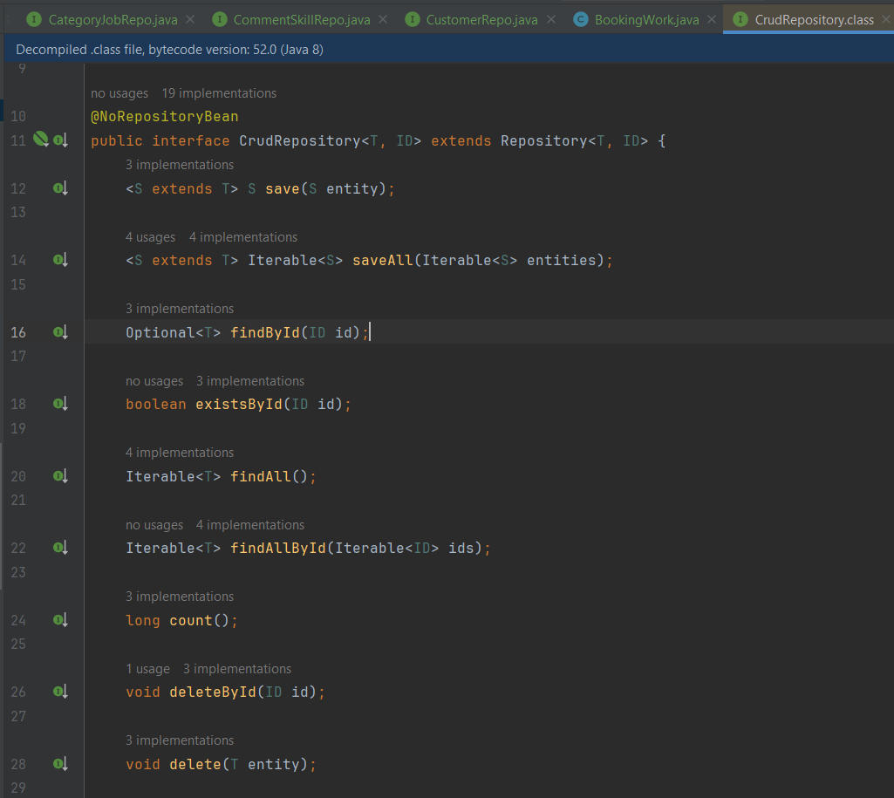
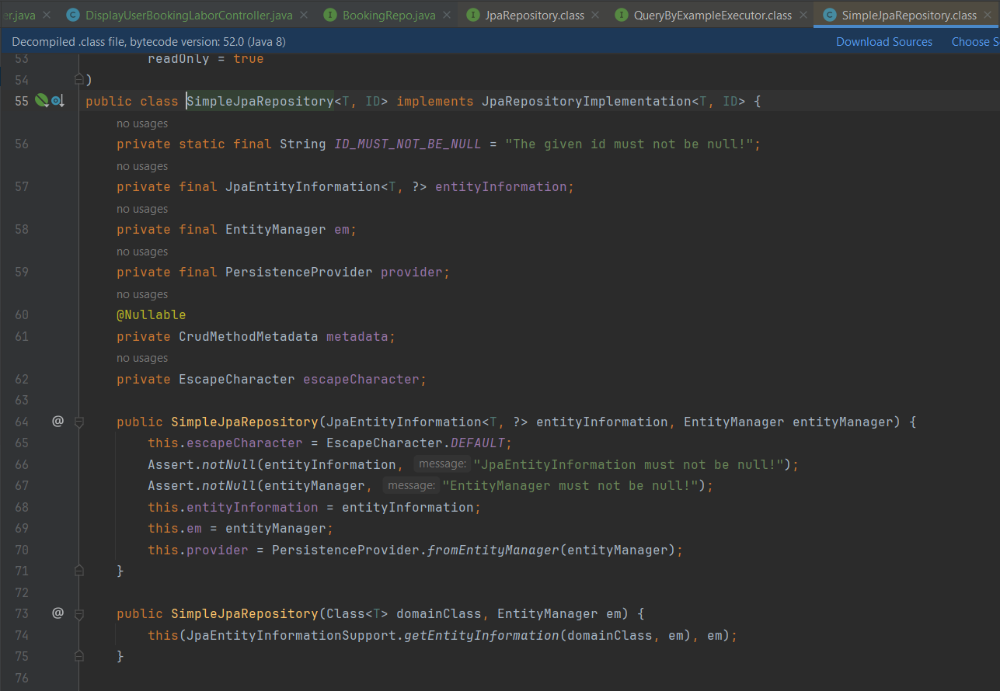
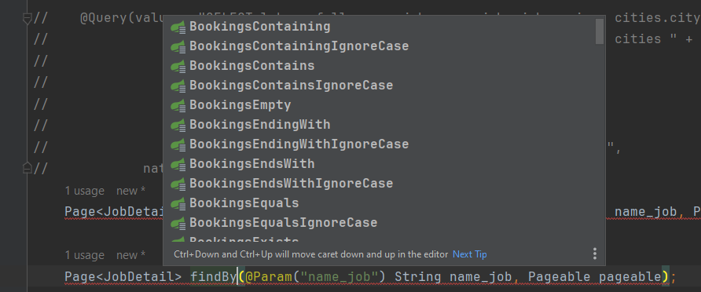
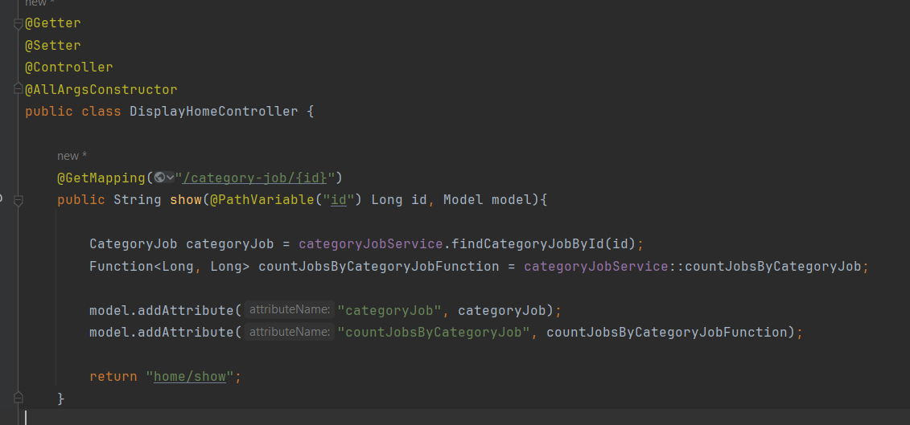
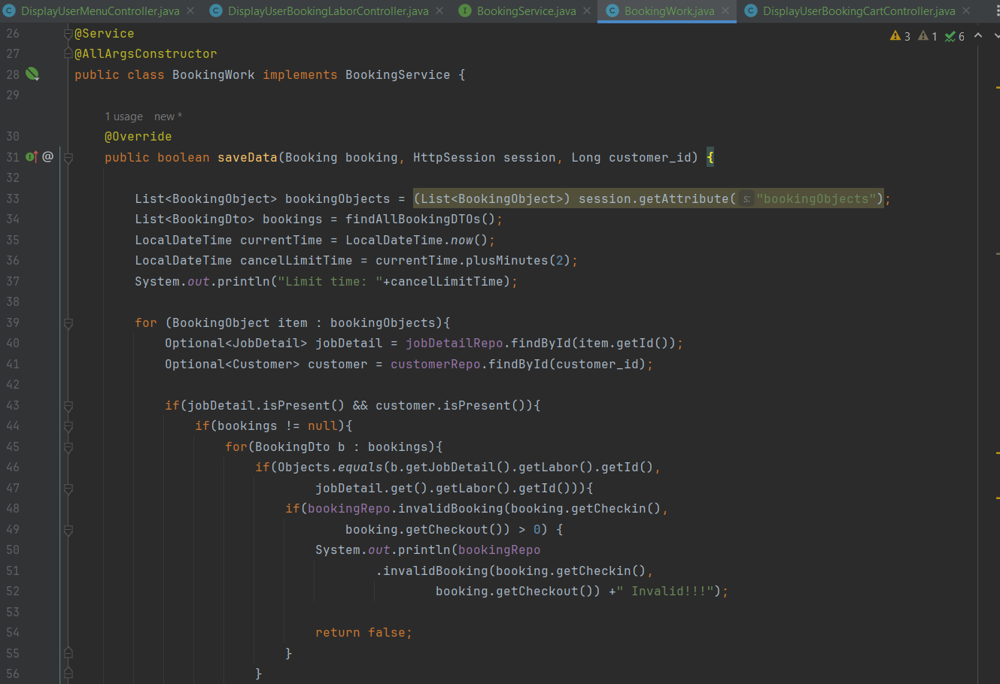
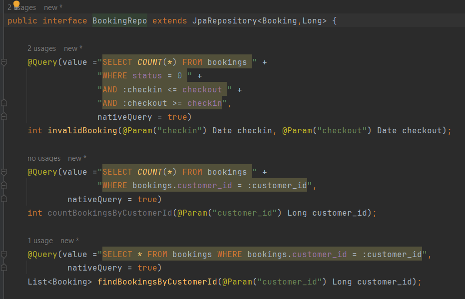

# Booking-Labors

## Ask and question, reply about java spring boot

### Hibernate

### Hibernate là gì?

```java

- Hibernate là 1 framework để kết nối đến cơ sở dữ liệu
- Hibernate framework là một giải pháp ORM (Object Relational Mapping) mã nguồn mở, gọn nhẹ. 
Hibernate giúp đơn giản hoá sự phát triển của ứng dụng java để tương tác với cơ sở dữ liệu.
- hibernate cung cấp cho chúng ta Tool ORM giúp đơn giản hoá việc tạo ra dữ liệu và
thao tác với dữ liệu. 

```
#### Example
```java
- Đây chính là mã nguồn mở về tool ORM mà Hibernate framework cung cấp cho chúng ta 
- nó là 1 thư viện đc viết sẵn
```


### ORM là gì?

```java
- ORM là object relationship mapping : là một kỹ thuật lập trình để ánh xạ tới đối tượng 
và lấy ra dữ liệu trong cơ sở dữ liệu.
- Chúng ta có thể hiểu đơn giản là:
- Hibernate sẽ lấy dữ liệu trong csdl ra sau đó lưu dữ liệu đó vào trong 1 bộ nhớ cache và trả
về object thô chưa qua sơ chế chứa dữ liệu đó, và để lấy được dữ liệu đó ra để hiển thị cho ng dùng nhìn thấy thì chúng ta phải phải duyệt object mapping ra giống như duyệt mảng để hiển thị tường tận dữ liệu ra cho ng dùng nhìn thấy
 
```
#### Example

```java
List<Booking> bookings = bookingRepo.findAll();
- Đây là 1 object relationship là 1 cục dữ liệu thô chưa được sơ chế (ánh xạ qua các cột(column))

public static Booking mapToBooking(Booking book){

        Booking booking = Booking.builder()
                .id(book.getId())
                .accept(book.getAccept())
                .status(book.getStatus())
                .total_price(book.getTotal_price())
                .book_address(book.getBook_address())
                .message(book.getMessage())
                .city_name(book.getCity_name())
                .checkin(book.getCheckin())
                .checkout(book.getCheckout())
                .cancel_time(book.getCancel_time())
                .createdOn(book.getCreatedOn())
                .updatedOn(book.getUpdatedOn())
                .build();

      return booking;        
}
@Override
public List<Booking> findAllBookings() {

    List<Booking> bookings = bookingRepo.findAll();

    return bookings.stream()
            .map(BookingMapper::mapToBooking)
            .collect(Collectors
            .toList());
}
- Đây cách ánh xạ vào đối tượng và qua các cột (column) trong object relationship và convert về dạng string object relationship


List<Booking> bookings = bookingService.findAllBookings();
- Đây là 1 string object relationship là 1 cục dữ liệu thô chưa được duyệt

for(int i=0; i<bookings.size(); i++){

   System.out.println(bookings.get(i));
}
- Còn đây là cách duyệt object để hiển thị ra dữ liệu tường tận cho người dùng nhìn thấy


```

### Ưu điểm của hibernate là gì?

```java

- ưu điểm là : 
+ mã nguồn mở và nhẹ
+ hiệu suất nhanh : hiệu xuất của hibernate framework nhanh bởi vì nó cung cấp cho chúng ta
bộ nhớ cache được sử dụng trong nội bộ hibernate framework.
+ vì được cung cấp 1 bộ nhớ cache nên sẽ ít truy cập trực tiếp đến cơ sở dữ liệu nên sẽ tương
tác với dữ liệu nhanh hơn
+ Truy vấn cơ sở dữ liệu độc lập
- Khi sử dụng hibernate framework chúng ta sẽ được cung cấp nhiều cách để tương tác vs csdl đó là: 
+ HQL (Hibernate sql): hibernate sql là sử dụng hàm được cung cấp sẵn bởi framework hibernate
 để tương tác với cơ sở dữ liệu theo ý muốn của chúng ta
+ sql native: sql native là tạo ra 1 hàm sau đó nhúng trực tiếp câu lệnh sql vào để tương
tác vs csdl
+ criteria
+ có thể mở rộng 1 cách hiệu quả và linh hoạt
+ hibernate framework hỗ trợ nhiều hệ cơ sở dữ liệu phổ biến ví dụ như: 
- MYSQL, PostgreSQL, Oracle, SQL server ...

```
#### Example

```java
- Đây là mã nguồn mở trong hibernate framework
```



```java
@Query(value ="SELECT COUNT(*) FROM bookings " +
              "WHERE bookings.customer_id = :customer_id",
            nativeQuery = true)
int countBookingsByCustomerId(@Param("customer_id") Long customer_id);
- Đây cách truy vấn sql native
+ truy vấn bằng cách nhúng sql vào trong annotion của framework

Page<JobDetail> findByJob_NameJobContaining(@Param("name_job") String name_job, Pageable pageable);
- Đây là cách truy vấn sử dụng HQL(hibernate query language)
+ Hàm này được framework xây dựng sẵn để chúng ta lấy dữ liệu theo ý muốn
- Đây là các hàm đc xây dựng sẵn mà hibernate framework cung cấp cho chúng ta 
```


### MVC

### MVC là gì?

```java
- MVC là Model View Controller
- Model là các đối tượng trong cơ sở dữ liệu tương ứng vs các bảng
- View là giao diện người dùng
- Controller là lớp trình bày (Presentation layer) là nơi để trình bày các logic xử lý yêu cầu
```

#### Example

```java
- Đây là 1 hàm trong lớp controller xử lý yêu cầu của người dùng 
```


### Service là gì?

```java

- Service là 1 lớp (logic layer) xử lý logic cho ứng dụng và yêu cầu của người dùng
- lớp service này sẽ được gọi qua lớp controller để trình bày

```

#### Example

```java
- Đây là 1 hàm trong lớp service xử lý logic yêu cầu của người dùng 
```


### Repository là gì?

```java

- Repository là 1 lớp (data layer) là nơi chứa các model object relationship thô chưa qua xử lý
- Để xử lý các object relationship thô chúng ta gọi qua lớp service và xử lý dữ liệu

```

#### Example
```java
- Đây là 1 hàm trong lớp repository chứa các hàm trả về model object relationship hoặc 1 trả 
về 1 kết quả gì đó ví dụ như đếm số lượng dữ liệu 
- hoặc chứa các hàm để thao tác với dữ liệu (Như thêm sửa xóa)
```



### Lambda function

### Lambda function là gì

```java
- Lambda function là 1 loại function trong các ngôn ngữ lập trình nó có thể gọi ra lambla_Func mà
không cần thêm dấu ngoặc () tức là không thực thi những gì nó làm. 
Nếu muốn truyền vào tham số thì làm như sau lambla_Func.apply(value1,value2)
* tuy nhiên lúc tạo ra lambla function phải tạo tham số truyền vào cho nó thì mới có thể truyền
vào đc tham số khi gọi ra 

```

#### Example

```java
//Lambda function vế trước là tham số đầu vào
// vế sau là tham số đầu ra
//truyền tham số ngoài view invalidAcceptFunction.apply(id);
Function<Long, Integer> invalidAcceptFunction = (id) -> {
    LocalDateTime accept_time = LocalDateTime.now();
    return bookingService.invalidAcceptBooking(accept_time, id);
};
//lambda void function
Runnable myLambda = () -> {
    System.out.println("Hello world");
};
- Đây là lambda function

myLambda;
invalidAcceptFunction;
System.out.println("Lambda Function: "+invalidAcceptFunction);
- Đây là cách gọi nó ra mà k cần thêm dấu ngoặc

invalidAcceptFunction.apply(1L)
myLambda.run();
- Đây là cách gọi nó ra và thực thi những gì nó làm


```